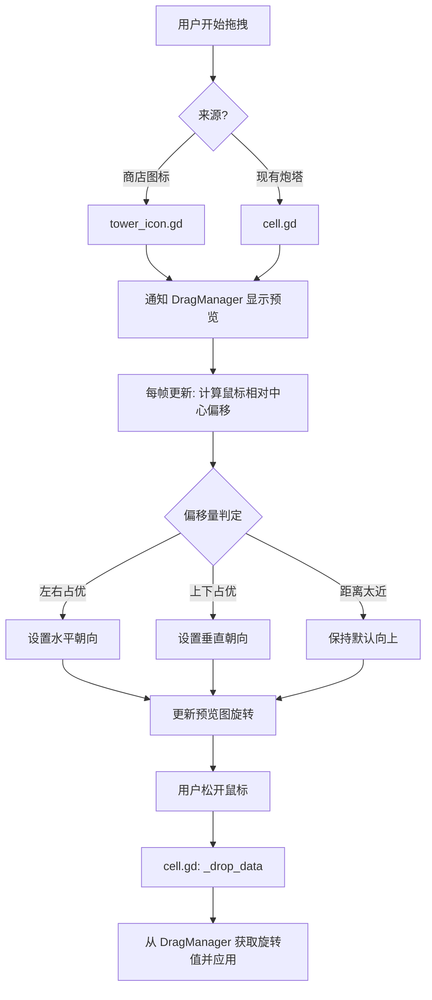

# 开发者文档 (Developer Documentation)

本文档旨在帮助开发者了解 **shooting-playground-godot** 项目的内部架构、核心逻辑实现以及系统间的交互方式。

---

## 1. 项目架构概述

项目采用 **信号驱动 (Signal-driven)** 和 **中心控制 (Centralized Control)** 相结合的模式。

-   **`main.gd` (主控制器)**: 负责全局游戏状态（开始/停止）、响应式布局计算、敌人管理器和子弹清理。
-   **`DragManager.gd` (单例/Autoload)**: 全局管理拖拽预览、旋转状态和当前选中的网格单元格。
-   **`GridManager.gd`**: 动态生成 5x5 网格，并处理边缘碰撞检测（敌人入侵判定）。
-   **`EnemyManager.gd`**: 负责敌人的预生成（显示警告图标）和实际生成逻辑。

---

## 2. 核心系统解析

### 2.1 拖拽与旋转系统 (Drag & Drop)

这是本项目最复杂的逻辑之一，允许用户在拖拽炮塔时通过鼠标偏移量决定炮塔的朝向。

#### 交互流程：
1.  **启动**: `tower_icon.gd` 或 `cell.gd` 触发 `_get_drag_data()`，并通知 `DragManager.start_drag()`。
2.  **过程**:
    *   `DragManager` 在每一帧更新预览图标的位置。
    *   源节点（Icon 或 Cell）计算鼠标相对于 **目标网格中心**（如果悬停在有效格子上）或 **自身中心** 的偏移。
    *   基于偏移量，通过四象限判定（上下左右）确定 `drag_rotation_offset`。
3.  **放置**: `cell.gd` 的 `_drop_data()` 被触发，从 `DragManager` 获取最终旋转值并应用到实例化的炮塔上。

#### Mermaid 流程图：

### 2.2 响应式布局实现

项目通过代码动态适配不同屏幕尺寸，确保游戏区域（GameContent）在宽屏下居中，在窄屏下占满。

-   **逻辑位置**: `main.gd` 中的 `_on_window_resize()`。
-   **原理**:
    1. 获取视口宽度。
    2. 计算 `target_width = min(window_width, 720)`。
    3. 动态调整 `GameContent` 下各主要面板（顶部工具栏、中心网格、底部商店）的 `anchor` 和 `offset`。

### 2.3 游戏循环与状态管理

游戏分为 **部署模式 (Deployment)** 和 **作战模式 (Battle)**。

-   **部署模式**: 允许拖拽。炮塔停止射击。显示敌人警告图标。
-   **作战模式**: 禁用拖拽。创建 `DeadZoneManager` 处理边界清理。启动所有炮塔定时器。生成敌人。

---

## 3. 重要信号说明

| 信号名 | 发起者 | 监听者 | 用途 |
| :--- | :--- | :--- | :--- |
| `tower_deployed` | `cell.gd` | `main.gd` | 告知主控有新炮塔加入，需根据当前游戏状态决定是否立即射击 |
| `enemy_breached_grid` | `grid_manager.gd` | `main.gd` | 敌人触碰边界，触发屏幕抖动并标记游戏失败 |
| `all_enemies_defeated` | `enemy_manager.gd` | `main.gd` | 检查 `enemy_breached_grid` 标记，弹出胜利或失败窗口 |
| `popup_closed` | `game_over_popup.gd` | `main.gd` | 触发游戏完全重置和下一波敌人预警 |

---

## 4. 物理层级 (Collision Layers)

-   **Layer 1**: 默认。
-   **Layer 2**: 敌人 (Enemies)。
-   **Layer 3**: 子弹 (Bullets)。
-   **Layer 5**: 网格边界碰撞区 (Grid Border Hitbox)。

---

## 5. 开发建议

-   **修改旋转逻辑**: 如果需要增加 8 方向支持，需修改 `cell.gd` 和 `tower_icon.gd` 中的 `_update_drag_rotation()`。
-   **添加新塔类型**: 在 `tower_icon.gd` 中导出不同的 `tower_scene` 即可。
-   **资源替换**: 子弹和炮塔的视觉表现主要在各自的 `.tscn` 文件中，炮塔使用了简单的 `Sprite2D` 旋转。
